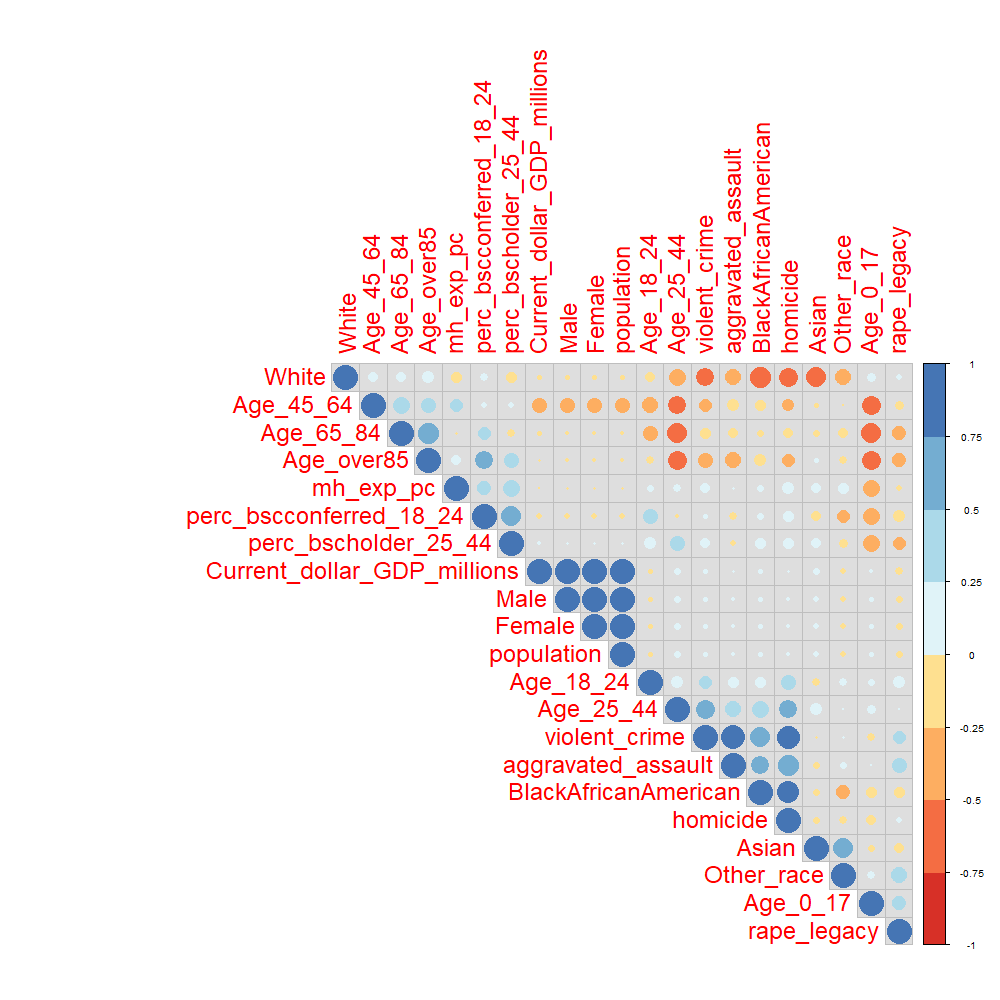
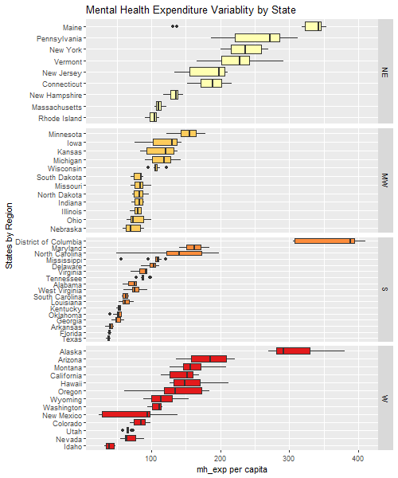

```{r, echo = FALSE, message = FALSE, warning=FALSE}
source(here::here("scripts/setup.R"))
source(here::here("scripts/Data_cleaning_script.R"))
source(here::here("scripts/EDA_script.R"))
```


## Data Overview

In this section we are going to do an explanatory data analysis by using the cleaned data described 
in the data part. Throughout the section, we will still need some transformation of the data to
facilitate the visualization and to understand everything in a deeper way.

To present the crimes and the race in a nicer way, we decide to mutate the former in term of "per 1000 inhabitants" and the latter in percentage terms. This makes sense also because different countries have different dimensions and population size. Therefore, maintaining absolute magnitudes would probably give us a wrong perception and result. We don't change the variables' names, though.

As you may have seen in the section on data, we end up having many features. Although some of them might be
irrelevant or redundant. To see that we use a straightforward correlation command; this can be already a step towards the selection of most important variables that we may need for our analysis later.


```{r, echo = FALSE, message = FALSE, warning=FALSE, results='hide'}
M <- project_1 %>%
  select(-c("State","Region","state_abbr", "year"))

M <- cor(M, use = "complete.obs")

filetag <- "corrplot_result.png"

png(filetag, height = 1000, width = 1000)
 corrplot(M, type="upper", order="hclust",
        col=brewer.pal(n=8, name="RdYlBu"), tl.cex = 2, bg = "gray87")
dev.off()
```

 <center> <p><p class="caption">Figure: Correlations among variables</p></p>  </center>

The main findings are:

<ul>
    <li>All variables describing the population, such as population, Female and Male, as well as age, are perfectly (or at least highly) correlated. For this reason, we can select population and ignore the amount of population which is female or male. Also because these values are always around 50% of population in each state, it wouldn't be too informative. Notice that, White and Black African-American seem negatively correlated, as well as Age_0_17 and Age_over85. These are only two examples, but the motivation is straightforward, i.e.: if the population is very young, it can't be old at the same time. </li>
    <li> White and crimes have a negative corellation, except for rapes, although for this the correlation seems small.</li> 
    <li> Black/African-American is positively related with all crimes, while Asian has only low correlations with them.
    </li>
    <li>Mental Health expenditure per capita appears positively correlated with education of the population, while its correlation with GDP doesn't seem relevant. Its correlation with crimes is dubious, we will better investigate on it with some visualization tools.</li>
    <li>GDP tends to be positively correlated with crimes, with exception of rapes. We will deepen this result later.</li>
    <li>It seems that a young population (18-44) leads to higher homicides, aggravated assaults and violent crimes. Meanwhile, older population (45+) appears negatively related with crimes. </li>
    <li>As you know, we have considered two proxies for Education until now, although they are highly correlated and it doesn't make sense to use both. Therefore, we decide to use perc_bscholder_25_44.</li>
    <li>Let's consider also correlations among crimes. As we would expect, the correlation between the different crimes is positive, indicating that there's little differentation. So, whenever criminality in a state is high, the level of all crimes is, more or less, high. Although, among them, rape seems to be the less correlated with the others.</li>
</ul>

Moving forward, having observed the correlations above, we can also look into each variable. 

To do so we can look up easily at the outcome of the data-set's summary.

For age:

```{r, warning=FALSE}
kable(do.call(rbind, lapply(project_1[,5:10], summary)), longtable=TRUE, caption="Age's variables summary statistics")%>%
  kable_styling(bootstrap_options = c("striped", "hover")) 
```

The highest percentage of population is between 25 and 64 years old while the lowest has more than 85 years.

For race:

```{r}
kable(do.call(rbind, lapply(project_1[,11:14], summary)), longtable=TRUE, caption="Race's variables summary statistics")%>%
  kable_styling(bootstrap_options = c("striped", "hover")) 
```

The majority of the population is white, followed by black and African-American. 

For crimes:

```{r}
kable(do.call(rbind, lapply(project_1[,21:24], summary)), longtable=TRUE, caption="Crimes' variables summary statistics")%>%
  kable_styling(bootstrap_options = c("striped", "hover")) 
```

Remember that crimes are expressed in per 1000 terms. <br>
Homicides are the less common crime, while violent crimes and aggravated assault occur on average to 4 and 2.5 people out of 1000.

For mental health expenditure, education, population and GDP:

```{r, warning=FALSE}

kable((do.call(rbind, lapply(project_1[,c(16:19,25)], summary)))[,1:6], longtable=TRUE, caption="Other variables summary statistics")%>%
  kable_styling(bootstrap_options = c("striped", "hover"))%>%
  scroll_box(width="100%")
```

In this last summary table, it's worth mentioning that 

<ul>
<li>The variablility of mental health expenditure per capita seems high.</li> 
<li>Population and GDP are not really interesting without further analysis and grouping by state or region, since the size of states can be very different, impacting these two variables.</li>
<ul>

## Univariate visualizations

To present the most important data by State we created an interactive map, you can access [by clicking HERE](https://lorenzomezzini.shinyapps.io/interactive_map/), which shows the selected variable distribution in US's states in a given year. 
Just to give you a preview of what you can see through our interactive map we report here the part of it with population values in 2004:

```{r, fig.cap="State's Population in 2004 in US"}
States <- readRDS(here::here('data/States.rds'))

labels <- sprintf(
            "<strong>%s</strong><br/>population: %g",
            States@data$NAME, States@data[["pop"]][["2004"]]/1000000)%>% 
            lapply(htmltools::HTML)

map <- leaflet(States,,height=600, width=800) %>%
  setView(-96, 37.8, 4) %>% # Us in the center
  addProviderTiles(providers$Stamen.Watercolor) %>%
  addPolygons(                             # Population poligons 2004
      color = "#444444", 
      weight = 1, 
      smoothFactor = 0.5,
      opacity = 1.0, 
      fillOpacity = 0.5,
      fillColor = ~colorQuantile("YlOrRd",  States@data[["pop"]][["2004"]]/1000000)( States@data[["pop"]][["2004"]]/1000000),
      highlightOptions = highlightOptions(color = "white", weight = 2, bringToFront = TRUE),
      label = labels,
      labelOptions = labelOptions(
          style = list("font-weight" = "normal", padding = "3px 8px"),
          textsize = "15px",
          direction = "auto"))
    
map
```

Moreover, we try to analyze graphically the main variables separately in order to potentially detect outliers or interesting path/characteristics.

### Mental Health Expenditure (per capita)

We start with a time series for mental health expenditure per capita, both for the whole US and the single regions. To do so we compute the median value in each region for every year and create a time series on R. Then we plot the whole thing in one graph: 

```{r}
time_series_1
```

We can see that in general, the expenditure per capita has increased from 2004 to 2013, with some ups and downs throughout the period. The downward sloping part are especially relevant in two regions, West and South between 2009 and 2010/11. We don't have enough data, but a possible explanation could be the financial crisis which had impact on government budgeting. The largest difference between 2004 and 2013 values is observed for North-East, while the smallest is for South, of which gap between these years is of $7 circa.
In the time series we only look at the median. It could be interesting to observe the same data through a boxplot to understand variability and outliers.

We start by looking at each regions and US in total.

```{r}
mh_exp_boxplot2
```

We notice that US has a low variability, but here data for US are already considered as a total, it doesn't consider each state observed. 
Instead, for the regions we capture, as before, that North-East is the one with largest variation, and we already know from the time series that this is due to the steadily increase in mh_exp per capita over the years. 

The boxplots are ordered by median and we can see how North-East is the one with greatest median and how US's median (which we can consider as the mean median across regions) is second for magnitude. Thus, it's driven significantly by North East states' spending. 

South and Mid-West are the regions in which states seem to spend less for mental health in per capita terms. 

We can clearly observe some outliers. But you can notice that they are quite clustered. Probably each group of outliers represents a state's observations in different years. These are not a problem for our analysis, therefore we just continue.

The second boxplot we propose is to shed the light on each region's state.


```{r, results='hide'}
filetag <- "mh_exp_boxplot.png"

png(filetag, height = 600, width = 500)
 mh_exp_boxplot
 dev.off()
```

<center> <p> </p> </center>

As we expected, in regions such as South and West, where we observed outliers in the boxplot before, there are states which appear far from the others. These are District of Columbia and Alaska. The latter is indeed on the west coast, but it's somehow detached from the other states of the region. Also District of Columbia is a case on its own since it's not a proper state but a federal district. 

We confirm that Mid-West is the region with less variability among its states in mental health expenditure per capita.

### Demographic: Age and Race Composition of the Population

Let's continue our univariate visualization part with demographics variables.

We do so by exploiting barplots. Again, we group results by regions as it can give us an idea of the distribution of population among the different US's areas. Of course, we continue to look also at the total US.
To group results by region we took median values and compute percentages of the population.

We start with a barplot for race composition of the population:

```{r}
ggplotly(demo_bar, width = 900, height = 500)
```

We immediately observe that between total US and North-East the difference is minimal. Although, no large difference is present for any of the region. In all of them there is a high prelevance of white people. The percentage for them is the highest in Mid-West area, while there's a particular high percentage of Black/African-American population in the South. <br> Moreover, while the group "other race" is a minority everywhere, it is not in the West, where instead Black/African-American percentage is lower than both asian and other races.

Now on age composition:

```{r}
ggplotly(demo_bar_2,width = 900, height = 500)
```

The same results on overall observations throughout US as we had on the summary table in the data overview section return here.
What's new is the fact that we can make consideration on the "age" of each region. Although the composition of the population does not change in a relevant way. 

### Demographic: Education

Again, we group results by region and we took median values of the percentage of bachelor's degree holder with age 25-44.
We can notice from the following graph that, using our proxy for education, we have a lower percentage of bachelor's holder in the South. Instead, North-East has 6% more educated people than the mean value of US.

```{r}
ggplotly(demo_bar_4,width = 900, height = 500)
```

We also look at a boxplot to understand the variability of education inside each region. 
The variability is not too high, although we observe some outliers in South, again we think they are due to District of Columbia:

```{r}
mh_exp_boxplot3
```


### Criminality Distribution Across States

Again, we group results by region we took median values and transform values in per 1000 terms. 
So, finally we ask ourselves the distribution of crimes in US.

```{r}
ggplotly(demo_bar_3,width = 900, height = 500)
```

South and West have the highest level of criminality, with a great departure from other regions for violent crimes and aggravated assaults. 
Violent crimes seem to be the most common crime, while homicide is the least frequent and it is the lowest in Mid-West.

## Multivariate visualizations

Now that we discussed variables by themselves, we can start to see the various relationships that exist between multiple variables at the same time.
Notice that when appropriate we use a log10 scale. This is useful for some of our variables because they cover a large range of values.
We also decide to remove District of Columbia and United States, since in most cases the first creates outliers and is not a proper state and because US are just a total sum observation. 

Since from the corrplot in the first part of the EDA section the correlation between mental health expenditure and criminality appeared dubious we start investigating this relationship through a scatterplot. We consider mental health expenditure per capita against the various kinds of criminality: homicides, violent crime, rape and aggravated assault.

```{r, warning=FALSE}
ggplotly(mh_exp_plot,width = 900, height = 500)
```

From the scatterplot above we can see that the overall correlation is slightly negative. Which means that for an increase in public mental health per capita spending there is, on average, a decrease in criminality.

Remember that from the corrplot we have identified a positive correlation between education and mental health expenditure per capita. The higher the education the higher is the spending for health. We tried to show this through a scatterplot and the outcome is exaclty what we expected by the corrplot, even if we don't rule out the District of Columbia.

This second scatterplot that we propose is criminality against education. 

```{r}
ggplotly(mh_exp_plot3,width = 900, height = 500)
```

Here we can see two distinct things. First of all the correlation is negative, thus, on average, the higher the education the lower is the criminality rate. The second thing we can notice is about the log GDP. In all the criminalities, except rape, the lighter dots (higher GDP) lies above the tendency line, while the darker dots (lower GDP) lies below. Therefore, there is a positive correlation between GDP and the kind of crimes we considered, except for rape, that has a negative correlation.

Now we want to see a few of the correlation we saw before, but in the time dimension.

First of all the effect of mental health expenditure on criminality over time. We decided to report here the time series for only one crime, homicide, since the patterns are similar for all the four of them:

```{r}
time_series_2
```

From this time series we can see how in the US the number of total homicides decreases over time. This can possibly follows from an increase in the mental health.


Now we check the mental health spending against the education over time.

```{r}
time_series_3
```

Here we see that the increase in education over the selected decade also correspond to an increase in the public expenditure in mental health.

Finally we check the homicides against the education. Again, the pattern is similar also for other type of crimes, therefore we report only the one for homicides:

```{r}
time_series_4
```

This final time series shows that in the decade of interest the decrease of homicides also correspond to an increase in education.

However to better understand all of these effect and draw stronger conclusions we should do some panel data analysis on the data-set as we will do in the next section.


